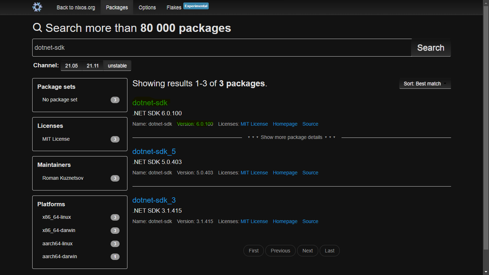

This test compares the speed of Rust, C, Node.JS, C#, Python, Java, Go, Kotlin and Ruby using an algorithm similar to [rwh_primes](https://stackoverflow.com/questions/2068372/fastest-way-to-list-all-primes-below-n/3035188#3035188). The output of the programs is not shown; you only see the time taken by each program. Use my [discord maths bot](https://discord.com/api/oauth2/authorize?client_id=837830928075194389&permissions=0&scope=bot), which includes a command with this language benchmarker, and more!

## Individual languages

You may want to see the output. Simply type these commands for each language, followed by the number you want to check up to:

| Language | Command                    |
| -------- | -------------------------- |
| Ruby     | `ruby primes.rb`           |
| Python   | `python primes.py`         |
| NodeJS   | `node primes.js`           |
| Java     | `java -cp Java primes`     |
| Others   | `<language>/SieveofAtkin`  |

Example: `ruby primes.rb 1000`, `Kotlin/primes 1000` both output:

```
2, 3, 5, 7, 11, 13, 17, 19, 23, 29, 31, 37, 41, 43, 47, 53, 59, 61, 67, 71, 73, 79, 83, 89, 97
Total: 25
```

# Versions of compilers and interpreters

Go to the file 'replit.nix', and see the packages listed there. To see the version of a language, go to [NixOS Search](https://search.nixos.org/packages?channel=unstable) and type in the package name. For example, for C#, there is a line in replit.nix which says `pkgs.dotnet-sdk`. Search up `dotnet-sdk` on the nix website, and you will see the version used. I will try to update the language versions as soon as new ones comes out, but please notify me if I fail to do so.  
  